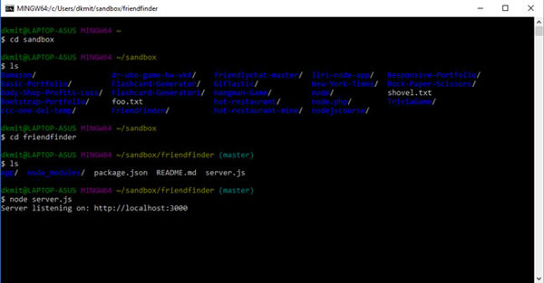
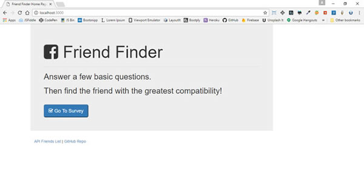
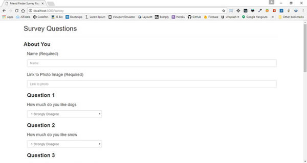
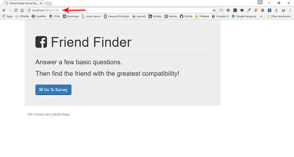

# FriendFinder
A compatibility-based "FriendFinder" application - basically a dating app. This full-stack site will take in results your users' surveys, then compare their answers with those from other users. The app will then display the name and picture of the user with the best overall match. 

#### Server Running

#### Home Page on localhost:3000

#### Survey page on localhost:3000

#### On-Error for bad location on localhost:3000

### Project Status: 
Uncompleted, need to complete the apiRoutes.js, and additional coding in server.js, still need to have survey send data to storage and bring back a match for the app to create the alert with the returning results. 

